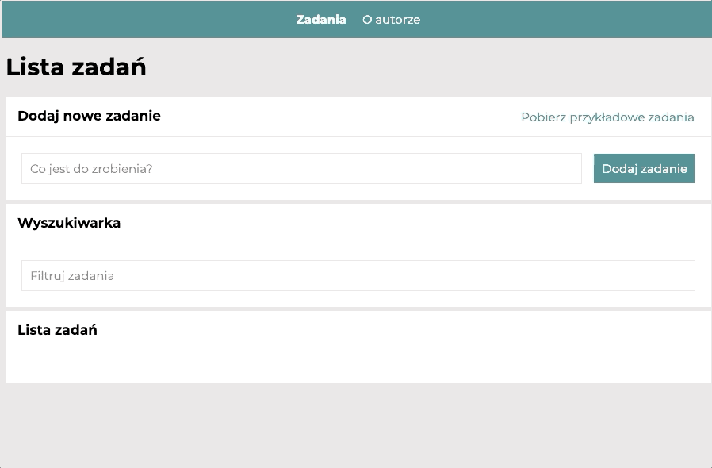

# Task list.
- autor: Wojciech Bylica
- updated: 18.07.2021
## Demo.
https://wojciechbylica.github.io/todo-list-react/
## Preview

### Description.

Simple List Of Things To Do is HTML page created as a homework during Frotend Developing Course in U-Code school. It allows you to:
- create a list
- add new list items
- check list items as "done"
- remove list items
- hide "done" list items
- check all tasks as done by one click
- search task
- load sample tasks
- check details of the task
- read info about autor

The app:
- escapes from writing html elements as tasks
- blocks adding empty tasks 
- sets focus on form input after starting the app and after adding new task
- shows info if there is an error in search URL
- saves and loads tasks in localStorage
### Technologies and concepts used to build the app:
- html
- Flex
- EC6+
- media querrys
- React
- Babel
- styled components
- Redux
- Redux-Saga
- Redux-Router
- Redux-Toolkit

This project was bootstrapped with [Create React App](https://github.com/facebook/create-react-app).

## Available Scripts

In the project directory, you can run:

### `npm start`

Runs the app in the development mode.\
Open [http://localhost:3000](http://localhost:3000) to view it in the browser.

The page will reload if you make edits.\
You will also see any lint errors in the console.

### `npm run build`

Builds the app for production to the `build` folder.\
It correctly bundles React in production mode and optimizes the build for the best performance.

The build is minified and the filenames include the hashes.\
Your app is ready to be deployed!

See the section about [deployment](https://facebook.github.io/create-react-app/docs/deployment) for more information.

### `npm run eject`

**Note: this is a one-way operation. Once you `eject`, you can’t go back!**

If you aren’t satisfied with the build tool and configuration choices, you can `eject` at any time. This command will remove the single build dependency from your project.

Instead, it will copy all the configuration files and the transitive dependencies (webpack, Babel, ESLint, etc) right into your project so you have full control over them. All of the commands except `eject` will still work, but they will point to the copied scripts so you can tweak them. At this point you’re on your own.

You don’t have to ever use `eject`. The curated feature set is suitable for small and middle deployments, and you shouldn’t feel obligated to use this feature. However we understand that this tool wouldn’t be useful if you couldn’t customize it when you are ready for it.

